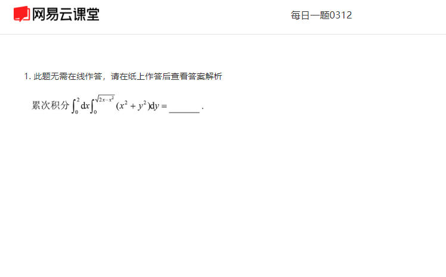
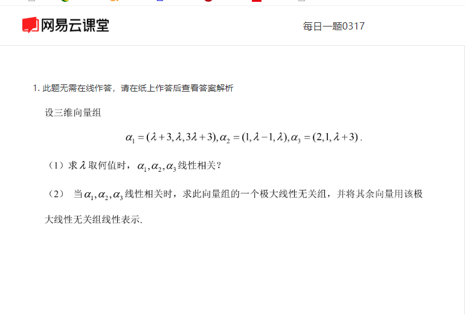
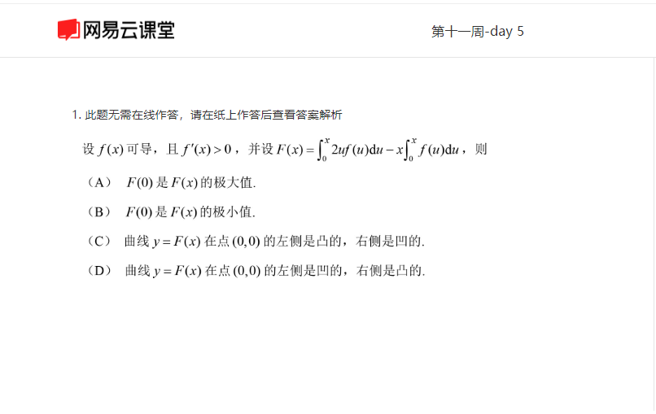
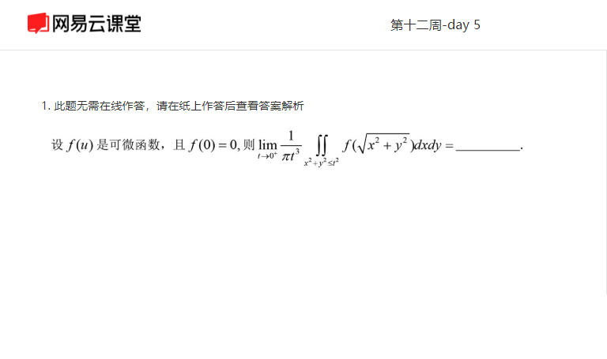

# 第1周
* 1

* 2

* 3

* 4

* 5

# 第2周
* 1

* 2

* 3

* 4

* 5

# 第3周
* 1

* 2

* 3

* 4

* 5

# 第4周
* 1

* 2

* 3

* 4

* 5

# 第5周
* 1

* 2

* 3

* 4

* 5

# 第6周
* 1

* 2

* 3

* 4

* 5

# 第7周
* 1

* 2

* 3

* 4

* 5

# 第8周
* 1

* 2

* 3

* 4

* 5

# 第9周
* 1

* 2

* 3

* 4

* 5

# 第10周
* 1

* 2

* 3

* 4

* 5

# 第11周
* 1

* 2

* 3

* 4

* 5

# 第12周
* 1

* 2

* 3

* 4

* 5

# 第13周
* 1

* 2

* 3

* 4

* 5

# 第14周
* 1

* 2

* 3

* 4

* 5

# 第15周
* 1

* 2

* 3

* 4

* 5

# 第16周
* 1
  
* 2
  
* 3
  
* 4
  

> 等待更新
